**Traffic Sign Recognition** 
---

**Build a Traffic Sign Recognition Project**

The goals / steps of this project are the following:
* Load the data set (see below for links to the project data set)
* Explore, summarize and visualize the data set
* Design, train and test a model architecture
* Use the model to make predictions on new images
* Analyze the softmax probabilities of the new images
* Summarize the results with a written report

## Rubric Points

The [rubric points](https://review.udacity.com/#!/rubrics/481/view) outlined in the project
guidelines contain the following points which I shall discuss in turn.

* Submission Files - The project submission includes all required files.
* Dataset Summary - The submission includes a basic summary of the data set.
* Exploratory Visualization - The submission includes an exploratory visualization on the dataset.
* Preprocessing - The submission describes the preprocessing techniques used and why these techniques were chosen.
* Model Architecture - The submission provides details of the characteristics and qualities of the architecture, such as the type of model used, the number of layers, the size of each layer. Visualizations emphasizing particular qualities of the architecture are encouraged.
* Model Training - The submission describes how the model was trained by discussing what optimizer was used, batch size, number of epochs and values for hyperparameters.
* Solution Design - The project thoroughly discusses the approach taken for deriving and designing a model architecture fit for solving the problem given.
* Acquiring New Images - The submission includes five new German Traffic signs found on the web, and the images are visualized. Discussion is made as to any particular qualities of the images or traffic signs in the images that may be of interest, such as whether they would be difficult for the model to classify.
* Performance on New Images - The submission documents the performance of the model when tested on the captured images. The performance on the new images is compared to the accuracy results of the test set.
* Model Certainty - Softmax Probabilities - The top five softmax probabilities of the predictions on the captured images are outputted. The submission discusses how certain or uncertain the model is of its predictions.
  
#### Additional Items, beyond core Rubric
* Augment the Training Data
* Analyze New Image Performance in More Detail
* Create Visualizations of the Softmax Probabilities
  

Submission Files - Writeup
---

The core submission files consist of:
  * This writeup
  * The ipython notebook code 
  * An html export of the output of running the python code
  

Here is a link to my [project code](https://github.com/cwelton/traffic-sign-classifier), including this writeup as well as the core python notebook,
images, and supporting files.

Here is a link to the [output of running the python notebook](https://cwelton.github.io/traffic-sign-classifier/Traffic_Sign_Classifier.html), 
which includes various charts and diagrams from the data.

Data Set Summary & Exploratatory Visualization
---

1. Provide a basic summary of the data set and identify where in your code the summary was done. In the code, the analysis should be done using python, numpy and/or pandas methods rather than hardcoding results manually.

   The code for this step is contained in the sixth code cell of the IPython notebook.  

   I used the basic python to calculate summary statistics of the traffic signs data set:

   * The size of training set is: 34,799 examples
   * The size of test set is: 12,630 examples
   * The shape of a traffic sign image is: (32, 32, 3)
   * The number of unique classes/labels in the data set is: 43

2. Include an exploratory visualization of the dataset and identify where the code is in your code file.

   The code for this step is contained in the ninth code cell of the IPython notebook.

   I used pandas to produce some summary statistics and graphed them using matplotlib.
   
   Here is an exploratory visualization of the data set. It is a bar chart showing how the training
   data is distributed between the different classes in the dataset:
   
   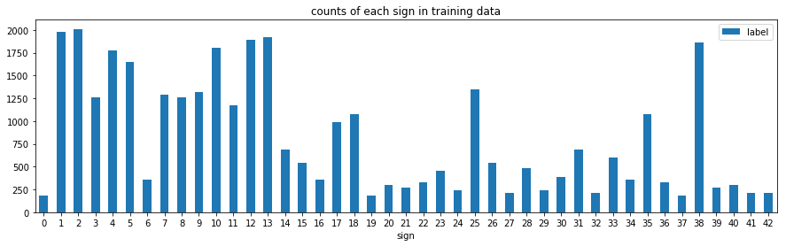
   
   Additional graphs showing similar breakouts of the validation and test dataset
   are available in the [output of running the python notebook](https://cwelton.github.io/traffic-sign-classifier/Traffic_Sign_Classifier.html),
   including example images of each class of sign within the dataset.

Design and Test a Model Architecture
---

1. Describe how, and identify where in your code, you preprocessed the image data. 
What tecniques were chosen and why did you choose these techniques? Consider including images 
showing the output of each preprocessing technique. Pre-processing refers to techniques such as 
converting to grayscale, normalization, etc.

   The code for this step is contained in the eleventh code cell of the IPython notebook.

   Based on [Traffic Sign Recognition with Multi-Scale Convolutional Networks](http://yann.lecun.com/exdb/publis/pdf/sermanet-ijcnn-11.pdf),
   I tried a number of preprocessing techniques including:
   - Conversion of images into the YUV color space
   - Normalization
   - Denoising
   
   Experimentally I found that of these the conversion of images into YUV color space
   helped substantially, however the other techniques lowered overall accuracy, so I
   ultimately removed them from my image preprocessing pipeline.
   
   Here is an example of a traffic sign image before and after conversion into the YUV
   color space.

   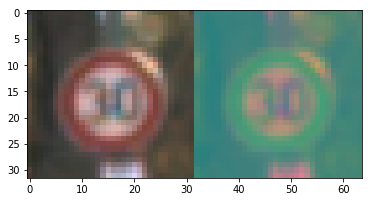

   The following example shows the original image, conversion to YUV, normalization, and denoising:
   
   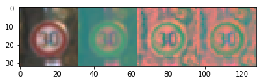

   Note however, in practice I found just the output of the YUV conversion performed better in
   practice, so the last two preprocessing options were explored, but ultimately not used.
   
2. Additional Data Augmentation

   (OPTIONAL: As described in the "Stand Out Suggestions" part of the rubric, if you generated 
   additional data for training, describe why you decided to generate additional data, how you 
   generated the data, identify where in your code, and provide example images of the additional data)
   
   After performing the data preprocessing the dataset was augmented using techniques described in
   the above referenced paper this included:
   * Generating 5x more training data
   * Each new training instance was:
      * Rotated by a random amount between +/- 15 degrees
      * Scaled by a random amount between 0.9 - 1.1 x the original image size
   * The data was also shuffled to reduce the effects of data ordering on the optimization algorithm.
   
   Here is an example of an original image and an augmented version of the image 
   
   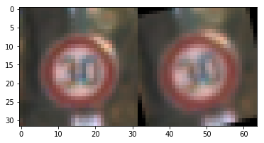

3. Describe how, and identify where in your code, you set up training, validation and testing data. 
How much data was in each set? Explain what techniques were used to split the data into these sets. 

   The data for training, validation, and testing data sets came pre divided in the sample data
   set provided.  No special processing was required to split the data into these sets other than
   loading each of supplied files.  This was handled in "Step 0" of my code as the data was loaded.
   
   To cross validate my model I ran "tf.softmax_cross_entropy_with_logits" on the validation set at
   the end of each epoch to monitor convergence and again on the test data at the end of training
   to confirm that the results roughly matched the validation results without introducing bias.
   
   My final training set, after augmentation, had 208,794 images, my validation and test sets had
   4,410 and 12,630 images respectively.
   

4. Describe, and identify where in your code, what your final model architecture looks like including model type, layers, layer sizes, connectivity, etc.) Consider including a diagram and/or table describing the final model.

   
   
   The code for my final model is located in the fifteen cell of the ipython notebook. 
   
   My final model consisted of the following layers:

   | Layer                  |     Description                               |
   |:----------------------:|:---------------------------------------------:|
   | Input                  | 32x32x3 YUV image                             |
   | Convolution 5x5        | 1x1 stride, valid padding, outputs 28x28x6    |
   | RELU                   |                                               |
   | Max pooling            | 2x2 stride                                    |
   | Convolution 5x5        | 1x1 stride, valid padding, outputs 10x10x16   |
   | RELU                   |                                               |
   | Max pooling            | 2x2 stride                                    |
   | Flatten                | outputs 400                                   |
   | Fully connected        | outputs 120                                   |
   | Fully connected        | outputs 84                                    |
   | Fully connected        | outputs 43                                    |
   | Softmax                |                                               |
 

Model Training
---

1. Describe how, and identify where in your code, you trained your model. The discussion can include the type of optimizer, the batch size, number of epochs and any hyperparameters such as learning rate.

   The code for training the model is located in the eighteenth, nineteenth and twentieth cells of the ipython notebook. 

   This is broken down into:
     - Setting up overall optimization layer on top of the LeNet archictecture outlined above
     - Initialization and/or loading the model from a previous save file
     - Iteration and training

   To train the model, I used an AdamOptimizer as a reasonable initial default optimizer 
   choice and ran models a couple of times to get to a good initial set of weights.

   The final model was calculated on about 300 epochs of data, the last 100 of which are
   shown in the html output of the python notebook. I ran the twentieth frame three times
   to do so, after the third time it seemed that little additional progress was being made
   so I stopped at that point.

   I used a batch size of 128, based on tuning from the prior exercise working with LeNet,
   and a learning rate of 0.0001, based on a little experimentation and tweaking around what
   seemed to work well for the dataset.

2. Describe the approach taken for finding a solution. Include in the discussion the results on the training, validation and test sets and where in the code these were calculated. Your approach may have been an iterative process, in which case, outline the steps you took to get to the final solution and why you chose those steps. Perhaps your solution involved an already well known implementation or architecture. In this case, discuss why you think the architecture is suitable for the current problem.

   The code for calculating the accuracy of the model is located in the twenty-second cell of the Ipython notebook.

   My final model results were:
      * training set accuracy of 89.9%
      * validation set accuracy of 80.1%
      * test set accuracy of 79.7%

   If an iterative approach was chosen:
      * What was the first architecture that was tried and why was it chosen?
      
         The initial architecture chosen was LeNet, because it provides a good baseline for image
         classification problems.
      
      * What were some problems with the initial architecture?
         
         Initial classification accuracy prior to preprocessing was very low.
      
      * How was the architecture adjusted and why was it adjusted? Typical adjustments could include choosing a different model architecture, adding or taking away layers (pooling, dropout, convolution, etc), using an activation function or changing the activation function. One common justification for adjusting an architecture would be due to over fitting or under fitting. A high accuracy on the training set but low accuracy on the validation set indicates over fitting; a low accuracy on both sets indicates under fitting.

         After adjusting the preprocessing of the data and data augmentation the LeNet architecture 
         started performing reasonably well.  There is some evidence of minor overfitting of the 
         data with the training set accuracy close to 90%, but validation and test closer to 80%.
         
         This may have been mediated by adding a dropout layer, but that is not included in this
         submission.

      * Which parameters were tuned? How were they adjusted and why?
      
         The main parameter that I found most relevant for reasonabl training was to adjust the
         learning rate.  I experimented with increasing and decreasing the rate until I found a 
         rate that seemed to work reasonably.
      
      * What are some of the important design choices and why were they chosen? For example, why might a convolution layer work well with this problem? How might a dropout layer help with creating a successful model?
      
         The convolution layers are good because they provide both a reduced model size and allow
         for a certain amount of translation invariance in the classification task.
         
         Relu layers are good for introducing a non-linear activation.
         
         A dropout layer can aid in generalization and reduce overfitting.
         

Test a Model on New Images
---

#1. Choose five German traffic signs found on the web and provide them in the report. 
For each image, discuss what quality or qualities might be difficult to classify.

I found 12 german traffic signs on the web for this section, they are as follows:

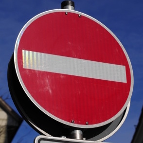
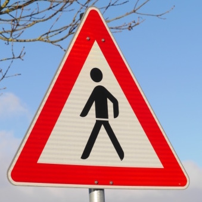
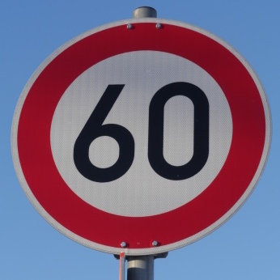
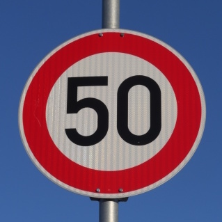
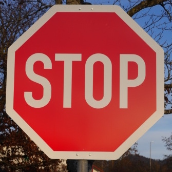
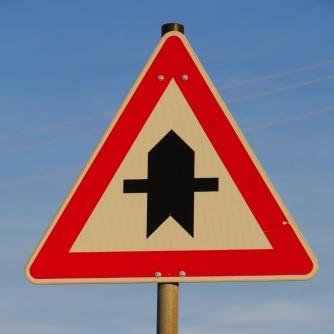
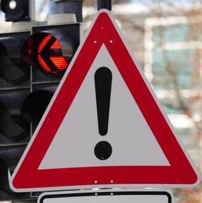
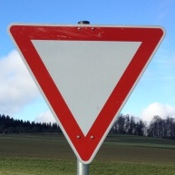
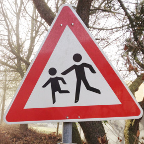

                        
The first image might be difficult to classify because ...

####2. Discuss the model's predictions on these new traffic signs and compare the results to predicting on the test set. Identify where in your code predictions were made. At a minimum, discuss what the predictions were, the accuracy on these new predictions, and compare the accuracy to the accuracy on the test set (OPTIONAL: Discuss the results in more detail as described in the "Stand Out Suggestions" part of the rubric).

The code for making predictions on my final model is located in the tenth cell of the Ipython notebook.

Here are the results of the prediction:

| Image			        |     Prediction	        					| 
|:---------------------:|:---------------------------------------------:| 
| Stop Sign      		| Stop sign   									| 
| U-turn     			| U-turn 										|
| Yield					| Yield											|
| 100 km/h	      		| Bumpy Road					 				|
| Slippery Road			| Slippery Road      							|

The model was able to correctly guess 4 of the 5 traffic signs, which gives an accuracy of 80%. This compares favorably to the accuracy on the test set of ...

####3. Describe how certain the model is when predicting on each of the five new images by looking at the softmax probabilities for each prediction and identify where in your code softmax probabilities were outputted. Provide the top 5 softmax probabilities for each image along with the sign type of each probability. (OPTIONAL: as described in the "Stand Out Suggestions" part of the rubric, visualizations can also be provided such as bar charts)

The code for making predictions on my final model is located in the 11th cell of the Ipython notebook.

For the first image, the model is relatively sure that this is a stop sign (probability of 0.6), and the image does contain a stop sign. The top five soft max probabilities were

| Probability         	|     Prediction	        					| 
|:---------------------:|:---------------------------------------------:| 
| .60         			| Stop sign   									| 
| .20     				| U-turn 										|
| .05					| Yield											|
| .04	      			| Bumpy Road					 				|
| .01				    | Slippery Road      							|

For the second image ... 
